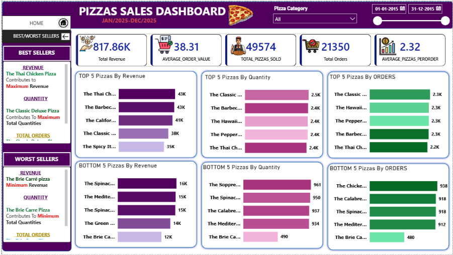
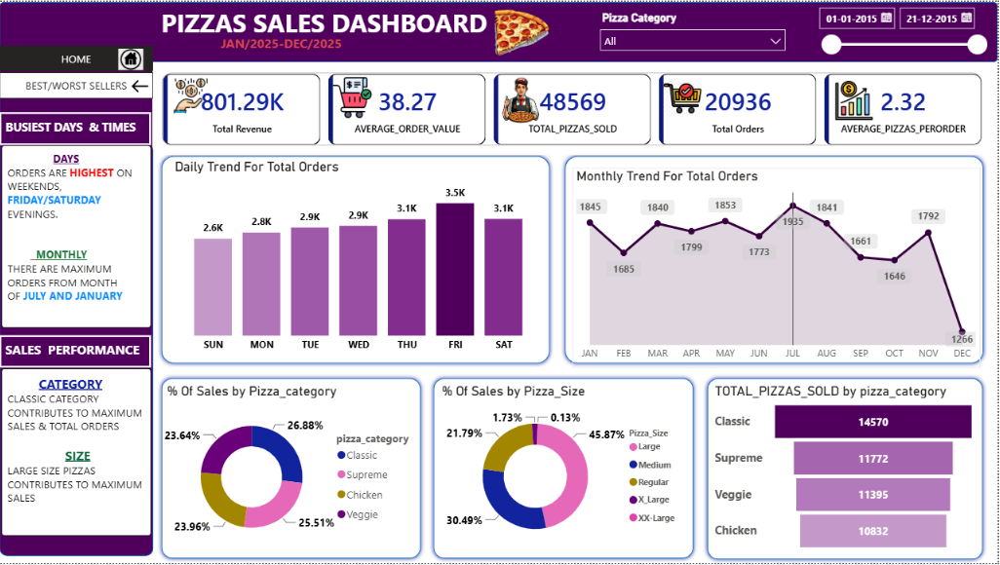

# 🍕 Pizza Sales Dashboard | SQL + Power BI Project

[](https://powerbi.microsoft.com/)
[](https://www.mysql.com/)
[](https://learn.microsoft.com/en-us/dax/)

## 📌 Project Overview
An end-to-end SQL + Power BI project analyzing **48,620 order-line records** from a pizza restaurant's full year of 2015 sales. MySQL queries were used to answer core business questions first, then the same logic was rebuilt as DAX measures in a two-page interactive Power BI dashboard covering daily/monthly trends and best/worst-selling products.

**Goal:** Identify which pizzas, categories, sizes, and days drive revenue and order volume, so the business can optimize its menu, staffing, and promotions.

## 🎯 Business Problem
A restaurant chain needs to know what's actually working on its menu and when demand peaks. This project answers:
- What are total revenue, orders, pizzas sold, and average order value for the year?
- Which days and months have the highest order volume?
- Which pizza categories and sizes contribute most to sales?
- Which specific pizzas are the best and worst performers by revenue, quantity, and order count?

## 📊 Dataset
| Field | Detail |
|---|---|
| Records analyzed | 48,620 order-line items |
| Period | January – December 2015 |
| Source file | [`pizza_sales.csv`](./data/pizza_sales.csv) |
| Fields | pizza_id, order_id, pizza_name_id, quantity, order_date, order_time, unit_price, total_price, pizza_size, pizza_category, pizza_ingredients, pizza_name |

## 🛠️ Tools & Approach
1. **MySQL** – Loaded data into a `pizza_db` database and wrote 15 queries ([`pizza_sales_queries.sql`](./sql/pizza_sales_queries.sql)) covering revenue, AOV, daily/monthly trends, and top/bottom-5 product rankings.
2. **DAX** – Translated the same business logic into Power BI measures (Total Revenue, Average Order Value, Total Pizzas Sold, Average Pizzas per Order).
3. **Power BI** – Built a two-page dashboard: an Overview page (KPIs, daily/monthly trends, category/size split) and a Best/Worst Sellers page (top & bottom 5 pizzas by revenue, quantity, and orders), with a Pizza Category slicer and date range filter.

## 📈 Dashboard Preview — Overview Page


## 📈 Dashboard Preview — Best & Worst Sellers Page


## 🔍 Key Insights (from the actual 48,620-row dataset)
- **Total Revenue: $817.86K** from **49,574 pizzas** across **21,350 orders**, with an Average Order Value of **$38.31** and **2.32 pizzas per order**.
- 
- **Friday is the single busiest day**, with **3.5K orders** — roughly 25% higher than the next-busiest days (Thursday and Saturday at ~3.1K) — a clear signal for weekend staffing and inventory planning.
- 
- **July and January are the strongest months**, while **December is the weakest month by a wide margin** (1,266 orders vs. a ~1,800 monthly average), pointing to a seasonal dip worth targeting with promotions.
- 
- **Classic and Supreme categories together account for over half of all sales** (26.9% and 25.5% respectively), making them the two categories to prioritize for ingredient stock and menu placement.
- 
- **Large pizzas drive 45.9% of all sales by size** — nearly double the next-largest size (Medium at 30.5%) — suggesting upsell-to-large promotions could meaningfully boost revenue per order.
- 
- **The Thai Chicken Pizza is the top revenue performer** (~$43K), while **The Brie Carré Pizza is the lowest performer across all three metrics** (revenue, quantity, and orders) — a strong candidate to re-price, reformulate, or remove from the menu.
- 
- **The Classic Deluxe Pizza leads in both quantity sold and order count**, confirming it as the restaurant's most reliable volume driver, not just a top revenue earner.

## 🚀 How to Use This Project
```bash
git clone https://github.com/ankitabisht-data-analyst/pizza-sales-sql-powerbi-dashboard.git
```
1. Create a MySQL database named `pizza_db` and load [`pizza_sales.csv`](./data/pizza_sales.csv) into a `pizza_sales` table.
2. Run the queries in [`pizza_sales_queries.sql`](./sql/pizza_sales_queries.sql) to validate the core metrics.
3. Open [`pizza_sales_dashboard.pbix`](./powerbi/pizza_sales_dashboard.pbix) in Power BI Desktop and refresh the data source.
4. Use the Pizza Category slicer and date range filter to explore the data interactively.

## 📈 Skills Demonstrated
`MySQL` `SQL Querying` `Power BI` `DAX` `Data Cleaning` `Data Visualization` `Sales Analytics` `KPI Reporting` `Dashboard Design`

## 📬 Contact
**Ankita Bisht** — Data Analyst
[LinkedIn](https://www.linkedin.com/in/ankita-bisht09) · [GitHub](https://github.com/ankitabisht-data-analyst)

⭐ If you found this project useful, consider giving it a star!
